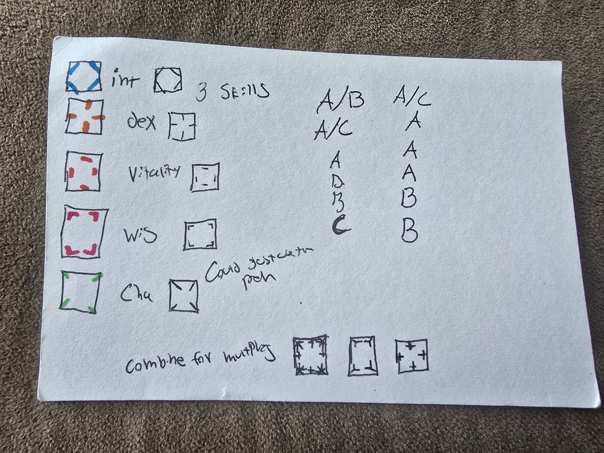

# Character Creation

What follows is a quick overview of character creation in the KISS dice TTRPG

## System Attributes

The blank dice system uses the following five
generic attributes for all general checks:

- intelligence (book smarts) : blue
- dexterity    (agility) : orange
- vitality     (physical prowess) : red
- wisdom       (street smarts) : purple
- charisma     (attractiveness / persuasiveness) : green

Each stat is represented by a different border and color around the edges of the dice (shown below). They are intended to be minimal,
as extra faces will be drawn onto the center of the dice in character creation.


[see the section on stat encoding for the graphics of each stat](#dice-layout-and-stat-encoding-quick-ref)

## Attribute Selection

Each character is represented by 3 six sided dice, created from a set of blank dice where each face on the dice represents a different game stat. Every character in the game receives a single "wild dice", this dice has every stat on it, plus one face that is a wild card, and counts as a success for ANY stat. We recommend drawing a "logo" for the character for the wild face!

The remaining two dice are the "character dice" for that character, they represent how good or bad that character is at any given task.

Characters in the game follow an A B C pattern. Where they are the best at stat A, ok at stat B, acceptable at stat C, and poor at all other attributes. Using this pattern, the following dice face layouts are created for their character dice (excluding the wild dice):

```txt
A/B    A/C
A/C    A
A      A
B      A
B      B
C      B
```

It is up to the player to select what attributes they want for A B and C.

## Skills Selection

Once attributes are created, the player needs to come up with five skills.
Skills are more specific things that a character is good at. They include any training, supernatural, or magical abilities that
the character has access to. Skills can be literally anything, as long as the player and game master agree ahead of time on that skill.

Of the six character skills, the player chooses 3 in the A B C pattern to represent the primary abilities and training of this character.
**These are what the character will most often rely on during play**, so choose carefully!

Then for each skill draw a face design for that skill. Place one face for each skill in the center of each non wild face on the wild dice,
and in the A B C pattern on your character dice.


once your skills are drawn on the dice you are ready to go!

### Skill Examples

- air bending
- fishing
- sword fighting
- piloting
- pickpocketing
- lighting


> TIP:
>
> Skills can be more or less specific depending on the setting! For example
> sword fighting can be a skill in its own right, but in a game world where EVERYONE is a sword fighter
> you might want to break it up into rapiears, longswords and shortswords. Talk to your game master about
> what makes sense for your game.


## Dice Layout And Stat Encoding Quick Ref


